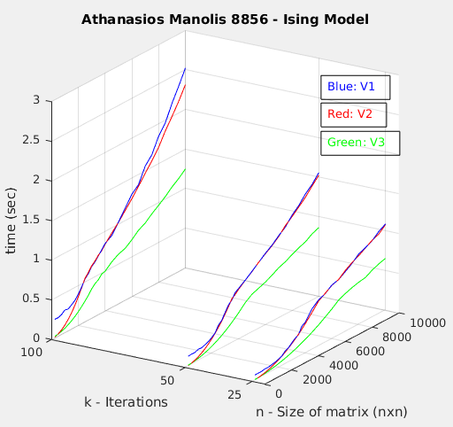
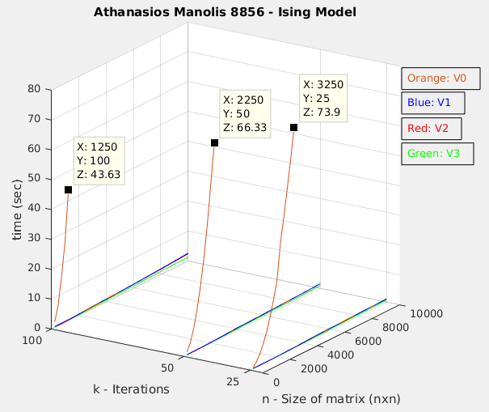

# Ising Model

## Description
Sequential and parallel implementation (with CUDA) of Ising Model. The are three CUDA implementations with the following characteristics:

* V1: GPU with one thread per moment
* V2: GPU with one thread computing a block of moments
* V3: GPU with multiple thread sharing common input moments

## Observations
Of course parallel implementation are by far faster and more effective than the sequential one. The fastest one is V3, while V1 and V2 are almost the same, as far as speed is concerned.

At the diagrams below you can see a comparison of the execution times of the parallel and sequential implementations with respect to size n and k.

### Comparison between parallel implementations

### Comparison between all implementations

## How to run it

1. If your gcc version is previous than gcc-7, then change it in the Makefile
2. Type ``make`` to compile all implementations, or ``make <exec_name>`` to compile
only one implementation
3. Execution:
    1. Sequential: ``./sequential arg1 arg2 arg3``
    2. V1: ``./v1 arg1 arg2 arg3``
    3. V2: ``./v2 arg1 arg2 arg3``
    3. V3: ``./v3 arg1 arg2 arg3``

The three arguments, are:
* arg1: n, size of matrix (nxn)
* arg2: k, iterations
* arg3: filename, if you want to write the output (runtime) to a file

If no arguments are included at the run command, then the executable will run with default values (n=517, k=1). If you enter no arguments, or if arg1 = 517, and arg2 = 1 or 4 or 11, then the validator will also run.
